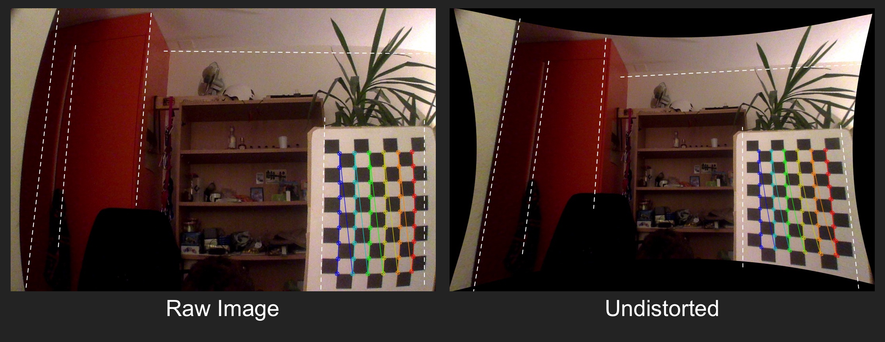
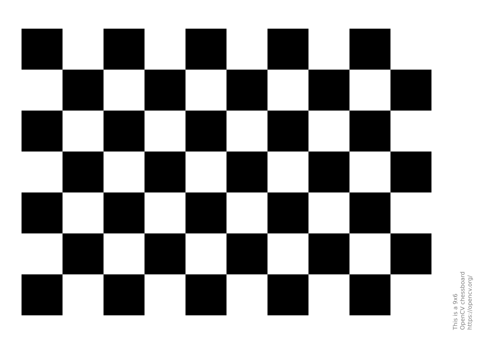

# CameraCalibration
Scripts to calibrate camera and undistort videos to remove the 'fisheye' effect as seen here:

---

# Requirements
The scripts are based on **numpy** and **opencv**. \
For an basic conda environment with the required libraries, input the following lines in a console: \
`conda create -n ipcam python=3.8.8 numpy=1.19.2` \
`conda activate ipcam` \
`conda install -c conda-forge opencv`

---

# Procedure
The scipts should be run in order, according to the script numbers. Open each script to select the correct paths, names and parameters.

1. `1_calibrate.py` reads the calibration video made with a checkerboard (see 'Camera calibration') and computes the camera matrix as well as the distortion coefficients. A few parameters are to be choosen at the beginning of the script (size of the undistorted videos, number of samples to calibrate, ...)
2. `2_selectzoom.py` is made to choose the zoom of the undistorted videos. In the example picture above, the output is "zoomed out" a little (black parts).\
*After those two steps, the file `parameters.py` is created and is unique to the camera it was calibrated on. If the resizing of the videos is to be changed for example, the first two scripts have to be executed again to create new parameters.*
3. `3_undistort.py` reads camera parameters from 'parameters.py' and undistorts videos from the 'Videos_in' folder. A preview is printed in the output folder of the first raw/undistorted frame for a confirmation of the current conversion. If the conversion is taking too long, consider resizing down the videos in '1_calibrate.py'.

---

# Camera calibration

To calibrate the camera, print a checkerboard pattern (e.g. `pattern.png` that is provided in the repository) and fix it on some cardboard (so that the paper stays flat). Then take a video with the camera to be calibrated and move/tilt the checkerboard all around its field of view, as it is shown in this [image](https://kr.mathworks.com/help/vision/ug/cameracalibrator_fov2.png). The video should be sufficiently long (e.g. 2 minutes) so enough datapoints can be extracted. For a good calibration, at least 50 datapoints should be used, the more the better. (This setting can be tuned in the `1_calibrate.py` script). Place the video in the 'Calibration_Video' folder and run through the procedure described above.

A checkerboard pattern such as this one can be used for the calibration:

---

Scripts and Example image author: Alex Bagnoud 
https://github.com/bagnoud-alex/Calibrate-and-Undistort

